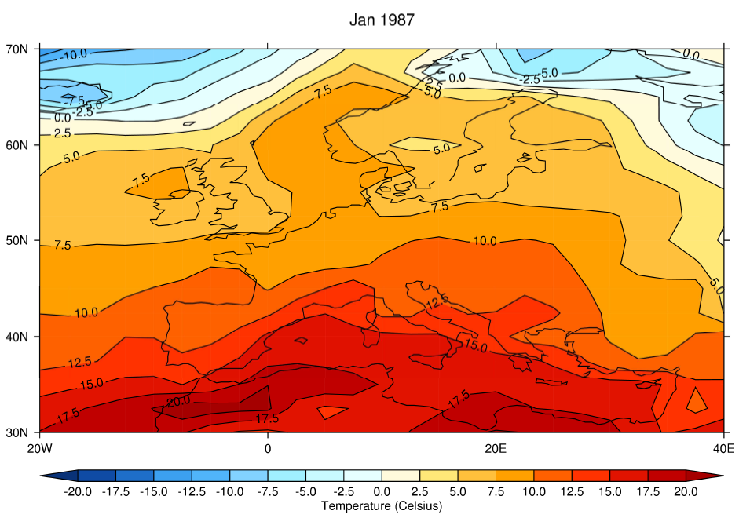

# ex2

ex2程序内容如下：

```text
PRO ex2
PSOPEN
MAP, LONMIN=20, LONMAX=40, LATMIN=30, LATMAX=70
LEVS, MIN=-20, MAX=20, STEP=2.5, NDECS=1
CON, F=SF('gdata.nc', 'temp', P=1000)
PSCLOSE
END
```

结果如下：



在第二个示例中，我们通过设置map映射/放大到一个指定区域：

```text
MAP, LONMIN=20, LONMAX=40, LATMIN=30, LATMAX=70
```

同时改变高度的等级，以更好地适应区域的温度范围。注意，所选择的高度，使所有的负温度是蓝色的。

在LEVS命令中 NDECS=1 使高度等级的小数位数被限制为1。

