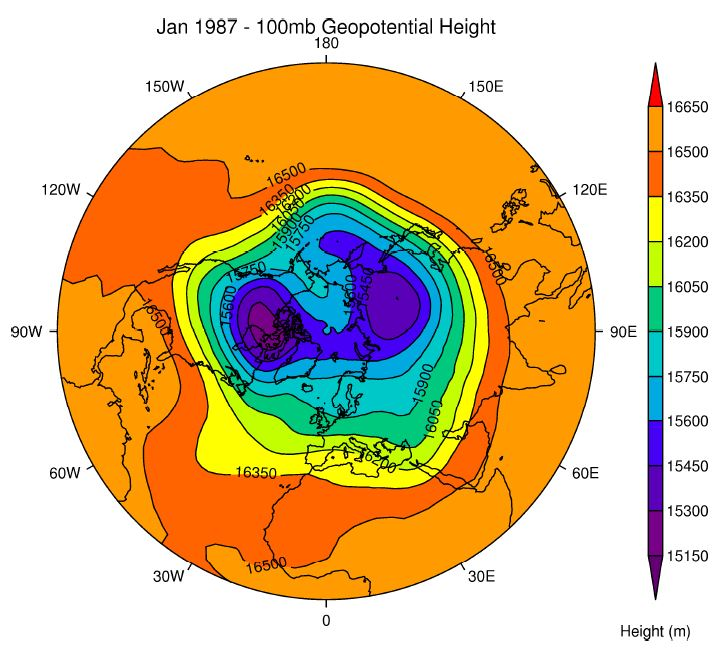

# ex3

ex3程序内容如下：

```text
PRO ex3
PSOPEN
CS, SCALE=33, NCOLS=12
MAP, /NH
LEVS, MIN=15150, MAX=16650, STEP=150
CON, F=SF('gdata.nc', 'ht', p=100), CB_TITLE='Height (m)', $
TITLE='Jan 1987 - 100mb Geopotential Height'
PSCLOSE
END
```

结果如下：



在这里我们选择100 mb的位势高度字段并使用/NH标志和MAP命令绘制一幅北半球极坐标图。

CS，SCALE=4 我们还使用了色标4，这更适合选定的区域。色标4是展示字段值增加连续性的色标。

CON命令通常超过一行，因此使用IDL的换行延续符号$。

