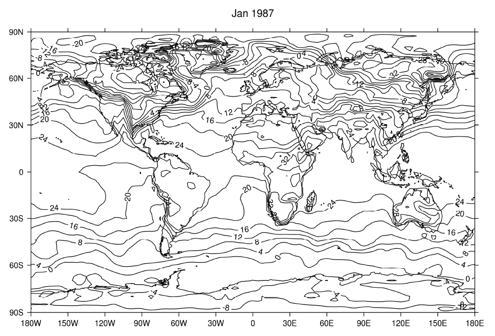

# ex4

ex4程序内容如下：

```text
PRO ex4
PSOPEN
CS, SCALE=1
MAP
LEVS, MIN=-32, MAX=32, STEP=4
CON, F=SF('gdata.nc', 'temp', p=1000), TITLE='Jan 1987', /NOFILL
PSCLOSE
END
```

结果如下：



若要创建未填充的的等高线图，可以在CON命令中添加/NOFILL选项

