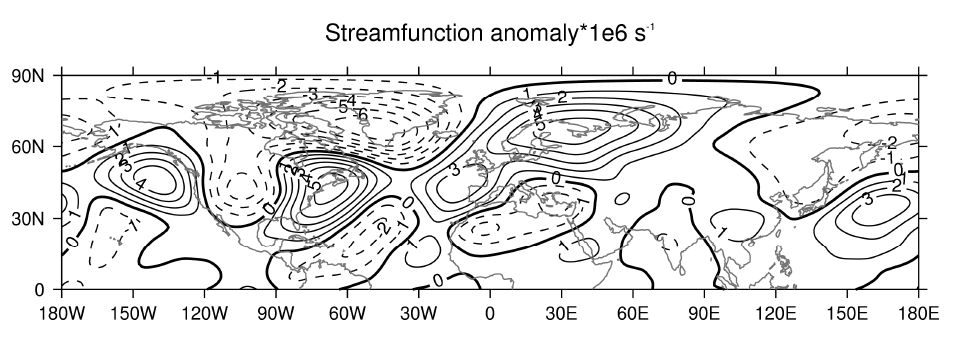

# ex5

ex5程序内容如下：

```text
PRO ex5
d=NCREAD('strf_anom.nc')
PSOPEN, XSIZE=20000, YSIZE=5000, CCOLOUR=7
CS, SCALE=7
MAP, LATMIN=0, /ISOTROPIC
LEVS, MIN=-6, MAX=5, STEP=1
CON, F=d.strf/1e6, X=d.x, Y=d.y, TITLE='Streamfunction anomaly*1e6 s!E-1!N', $
NEGATIVE_STYLE=2, ZERO_THICK=200, /NOFILL
PSCLOSE
END
```

结果如下：




