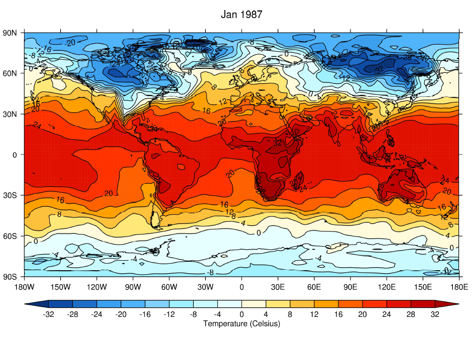

# ex1

ex1程序内容如下：

```text
PRO ex1
d=NCREAD('gdata.nc')
PSOPEN
CS, SCALE=1
MAP
LEVS, MIN=-32, MAX=32, STEP=4
CON, FIELD=d.temp(*,*,0), X=d.lon, Y-d.lat, TITLE='Jan 1987', CB_TITLE='Temperature(Celsius)'
PRINT, d.p(0)
1000.00
PSCLOSE
END
```

结果如下：



ex1逐行解释如下：

```text
;命名这个程序为ex1
PRO ex1

;读取一个名为gdata.nc的netCDF文件
d=NCREAD('gdata.nc')
;这一步将netCDF文件中请求的数据储存在一个称为d的结构中，在这种情况下，读取了netCDF所有变量。

;打开一个postscript文件
PSOPEN

;设置颜色比例为1
CS, SCALE=1

;设置圆柱地图投影
MAP

;明确等高线的高度（等级）
LEVS, MIN=-32, MAX=32, STEP=4
;在这个样例中，设置为最小值-32，最大值32，步长（间隔）为4 

;设置等高线制图
CON, FIELD=d.temp(*,*,0), X=d.lon, Y-d.lat, TITLE='Jan 1987', CB_TITLE='Temperature(Celsius)'
;这句CON命令，我们从netCDF文件gdata.cn中读取在1000mb的温度一栏的值。

;关闭并查看postscript文件
PSCLOSE

;结束程序
END
```

我们也可以使用下面的命令选择并绘制等高线：

```text
d=NCREAD('gdata.nc')
CON,F=d.temp(*,*,0), X==d.lon, Y=d.lat,,TITLE='Jan 1987', CB_TITILE='Temperature(Celsius)'
```

我们知道温度域内等级0的是1000mb，如在IDL中输入

```text
PRINT，d.p(0)
```

显示输出

```text
1000.00
```


在UNIX命令行中输入gex，gdata或glib来访问程序示例，数据或库。首先，将与您要绘制的制图最接近的示例复制到您指定的主目录。然后修改代码，尝试使用您的数据和参数，例如：

```text
gex
cp ex1.pro~
cd ~
nedit ex1.pro&
```

然后按照需要修改ex1.pro中的代码.这个新版本的ex1.pro在当前文件夹中优先于示例文档中的ex1.pro。

如果您修改了ex1.pro，运行前需要重新编译：

```text
idl
.compile ex1
ex1
```

随着您对绘图示例程序越来越熟悉，您将能够在不参考示例代码的情况下编写绘图代码。


